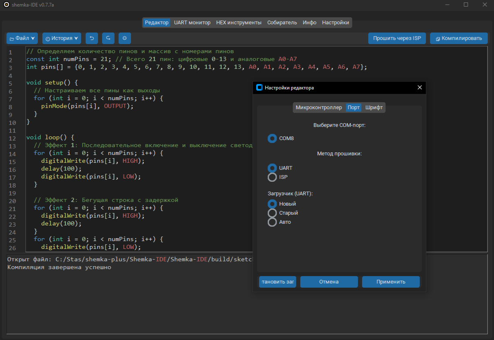
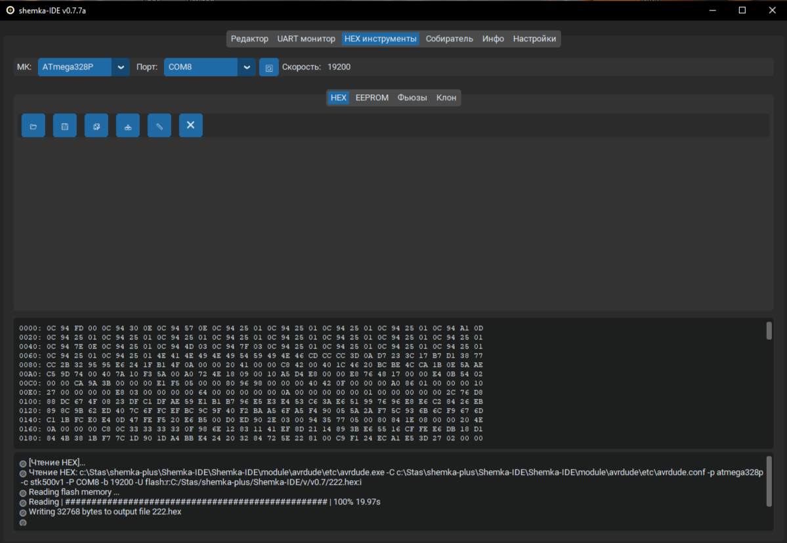
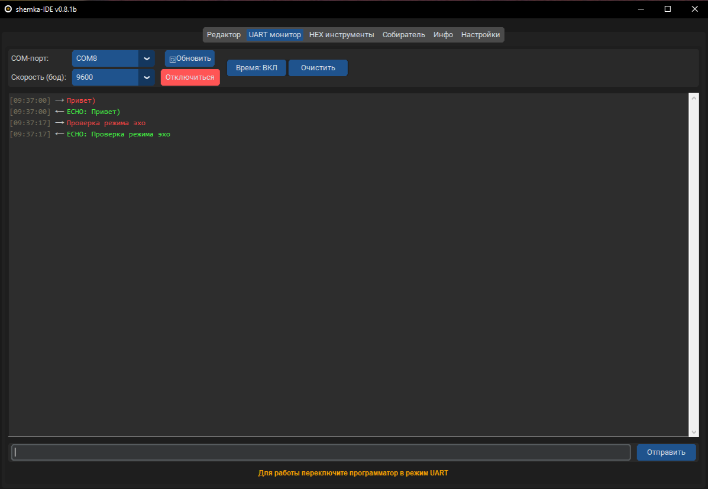
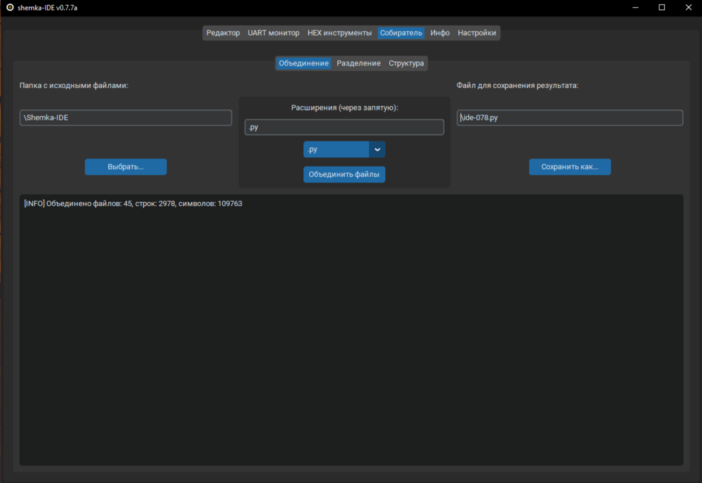
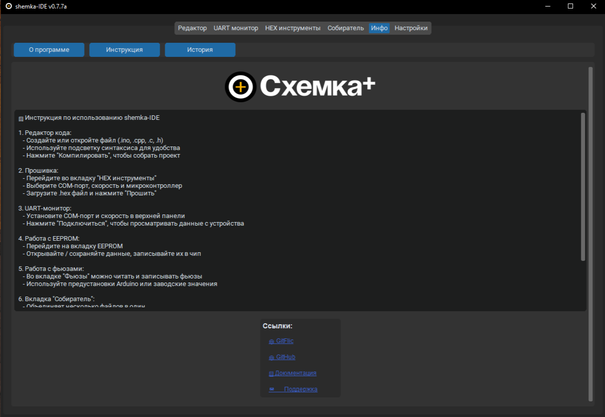
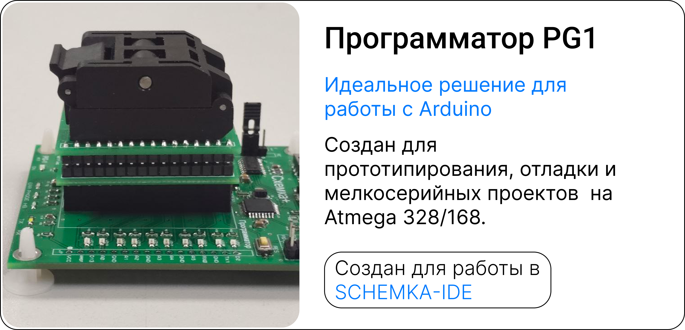

# Schemka-IDE 🔧 от Схемка+

**Schemka-IDE** — это современная кроссплатформенная среда разработки и прошивки микроконтроллеров AVR, разработанная командой **Схемка+**. Идеально подходит для работы с ATmega, ATtiny и совместимыми МК, как в образовательных, так и в инженерных проектах.

---

## 🚀 Возможности

### ✍️ Редактор кода
- Подсветка синтаксиса
- Вкладочный интерфейс
- Панель быстрого доступа
- Поддержка шрифтов и тем

---

### 🧩 HEX-инструменты
- Открытие и просмотр HEX-файлов в классическом виде:
0000: 0C 94 5C 00 0C 94 6E 00 ...
- Сохранение HEX
- Прошивка / Чтение / Верификация памяти Flash
- Очистка чипа
- EEPROM: чтение и запись
- Фьюзы: чтение и запись
- Клонирование чипа: сохранение Flash, EEPROM и фьюзов
- Восстановление из проекта

---

### 🔨 Поддержка прошивки
- UART загрузка (Arduino bootloader)
- ISP (stk500v1)
- Поддержка старого и нового загрузчика
- Автоматический выбор скорости
- Сброс по DTR перед прошивкой
- Восстановление загрузчика (bootloader) через ISP

---

### 📡 UART монитор
- Чтение данных с микроконтроллера через COM-порт
- Настройка скорости и порта
- Подходит для отладки и взаимодействия с платами

---

### 🧱 Собиратель проектов
- Упрощённый сборщик прошивок
- Управление зависимостями
- Импорт шаблонов

---

### 🧾 Информация и поддержка
- Версия прошивки и IDE
- Информация о лицензии и разработчике

---

## Программаторы
- Программа разрабатывалась для программаторов PG-1
- PG-1 предоставлят большие возможности для работы с микроконтроллерами ATMEGA, LGT8F и других совместимых 

---

## 🛠 Установка

### 1. Клонируйте репозиторий

git clone https://github.com/shemka-plus/Shemka-IDE
cd shemka-ide

### 2. Установите зависимости

pip install -r requirements.txt
⚠️ Требуется Python 3.10 или выше

### 3. Запуск

python main.py

### 📦 Структура проекта

Shemka-IDE/\
├─ gui/                 → Интерфейс редактора, настройка тем\
├─ core/                → Запуск, конфигурация\
├─ utils/\
│   ├─ editor/          → Логика вкладки редактора\
│   ├─ hex_tools/       → HEX, EEPROM, фьюзы, клон\
│   └─ uart_monitor.py  → Мониторинг COM-порта\
├─ module/avrdude/      → avrdude.exe и конфигурация\
├─ bootloaders/         → HEX-файлы загрузчиков\
├─ docs/img/            → Скриншоты\
├─ main.py              → Точка входа\
└─ requirements.txt     → Зависимости

### 📄 Лицензия
Проект распространяется под лицензией MIT.

© Схемка+, 2025